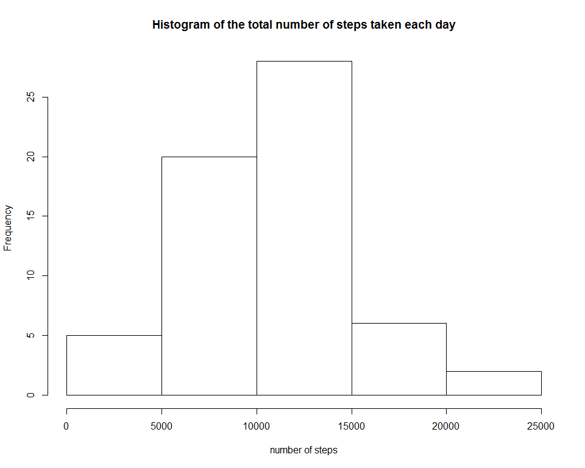

# Reproducible Research: Peer Assessment 1


## Loading and preprocessing the data


```r
# unzip activity.zip file
unzip("activity.zip")
# read activity.csv file call activity monitoring data = amd
amd <- read.csv("activity.csv", sep=",")
```

## What is mean total number of steps taken per day?

```r
#  ignore the missing values in the dataset and sum steps and date
total_step <- tapply(amd$steps, amd$date, sum, na.rm = TRUE)

# make a histogram

hist(total_step, xlab = "Number of steps", main = "Histogram of the total number of steps taken each day")
```

 

```r
# mean and median total number of steps taken per day

mean(total_step)
```

```
## [1] 9354.23
```

```r
median(total_step)
```

```
## [1] 10395
```


## What is the average daily activity pattern?

```r
# find the average number of steps for all days
amd$interval <- as.factor(amd$interval)
step_average <- tapply(amd$steps, amd$interval, sum, na.rm = TRUE)/length(levels(amd$date))
# plot the Average number of steps taken in 5-minute interval across all days
plot(x = levels(amd$interval), y = step_average, type = "l", xlab = "Time", 
     ylab = "Number of steps", main = "Average number of steps taken in 5-minute interval across all days")
```

 

```r
# find the maximum number of steps on average
names(which.max(step_average))
```

```
## [1] "835"
```

## Imputing missing values

```r
# find total number of missing values = na_number
na_number <- sum(!complete.cases(amd$steps))

# fill na with average steps
original_data <- amd
for (i in 1:length(amd$steps)) {
  if (is.na(amd$steps[i])) {
    for (j in 1:length(step_average)) {
      if (as.character(amd$interval[i]) == names(step_average[j])) 
        amd$steps[i] = step_average[j]
    }
  }
}
clean_data <- amd

clean_step_sum <- tapply(clean_data$steps, clean_data$date, sum, na.rm = TRUE)
# create the histogram with fill na

hist(clean_step_sum, xlab = "number of steps", main = "Histogram of the total number of steps taken each day")
```

 

```r
# find the mean and median total number of steps taken per day
mean(clean_step_sum)
```

```
## [1] 10581.01
```

```r
median(clean_step_sum)
```

```
## [1] 10395
```

###Do these values differ from the estimates from the first part of the assignment? What is the impact of imputing missing data on the estimates of the total daily number of steps?
* No difference in median but we see a difference in mean. 

## Are there differences in activity patterns between weekdays and weekends?


```r
# create a factor variable in the dataset with two levels - "weekday" and "weekend".
weekday <- weekdays(as.Date(clean_data$date, "%Y-%m-%d"))
for (i in 1:length(weekday)) {
  if ((weekday[i] == "Saturday") | (weekday[i] == "Sunday")) 
    weekday[i] = "weekend" else weekday[i] = "weekday"
}
clean_data$weekday <- as.factor(weekday)

clean_data2 <- split(clean_data, clean_data$weekday)
weekday <- clean_data2$weekday
weekend <- clean_data2$weekend
step_average_weekday <- tapply(weekday$steps, weekday$interval, sum, simplify = TRUE)/(length(weekday$weekday)/288)
step_average_weekend <- tapply(weekend$steps, weekend$interval, sum, simplify = TRUE)/(length(weekend$weekday)/288)

# create data out for the time series plot
output <- data.frame(steps = c(step_average_weekday, step_average_weekend), 
                     
                     interval = c(levels(amd$interval), levels(amd$interval)), weekday = as.factor(c(rep("weekday", 
                                                                                                                   length(step_average_weekday)), rep("weekend", length(step_average_weekend)))))

#panel plot time series 
library(lattice)
xyplot(steps ~ interval | weekday, data = output, type = "l",layout = c(1, 2), ylab = "Number of steps", xlab="Interval",
       main = "Average number of steps for all weekday days or weekend days")
```

 


